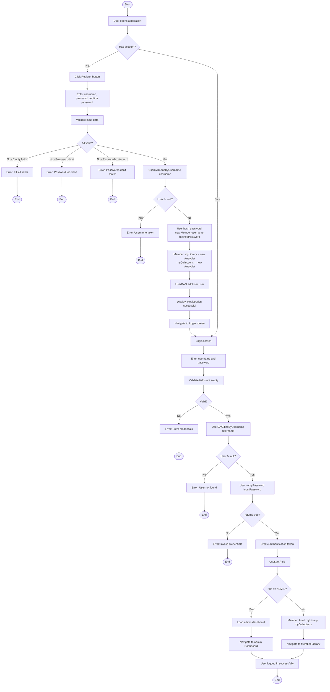

# User Registration and Login Activity Diagram

## Required Methods

### User (Abstract Class)
- `hash(String password): String` - Hash password using BCrypt
- `verifyPassword(String inputPassword): boolean` - Verify password against stored hash
- `getRole(): String` - Return user role (ADMIN or MEMBER)
- `getUsername(): String` - Get username
- `getCreatedAt(): Date` - Get account creation date

### Member (extends User)
- `Member()` - Constructor
- Initialize `myLibrary: List<BookProgress>`
- Initialize `myCollections: List<Collection>`
- `getRole(): String` - Override to return "MEMBER"

### Admin (extends User)
- `Admin()` - Constructor
- `getRole(): String` - Override to return "ADMIN"

### UserDAO
- `findByUsername(String username): User` - Find user by username
- `addUser(User user): void` - Insert new user into database
- `checkUsernameExists(String username): boolean` - Check if username is taken
