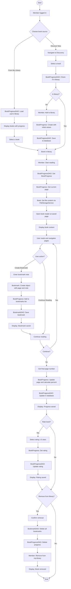

# Member Reading Workflow Activity Diagram

```mermaid
flowchart TD
    Start([Start]) --> MemberLoggedIn[Member logged in]
    MemberLoggedIn --> ChooseSource{Choose book source}
    
    ChooseSource -->|From My Library| LoadLibrary[BookProgressDAO: Load user's library]
    LoadLibrary --> DisplayLibrary[Display books with progress]
    DisplayLibrary --> SelectFromLib[Select a book]
    SelectFromLib --> AlreadyInLib[Book in library]
    
    ChooseSource -->|Discover New| DiscoverBooks[Navigate to Discovery]
    DiscoverBooks --> SelectNewBook[Select a book]
    SelectNewBook --> CheckInLib[BookProgressDAO: Check if in library]
    CheckInLib --> InLibrary{In library?}
    
    %% ADD TO LIBRARY
    InLibrary -->|No| AddToLibrary[Member: Add to library]
    AddToLibrary --> CreateProgress[BookProgress: Create with initial values]
    CreateProgress --> SaveProgress[BookProgressDAO: Save to database]
    SaveProgress --> AlreadyInLib
    
    InLibrary -->|Yes| AlreadyInLib
    
    %% START READING
    AlreadyInLib --> StartReading[Member: Start reading]
    StartReading --> GetProgress[BookProgressDAO: Get BookProgress]
    GetProgress --> GetCurrentPage[BookProgress: Get current page]
    GetCurrentPage --> LoadBookFile[Book: Get file content via FileStorageService]
    LoadBookFile --> OpenReader[Open book reader at saved page]
    OpenReader --> DisplayContent[Display book content]
    
    %% READING SESSION
    DisplayContent --> UserReads[User reads and navigates pages]
    UserReads --> ReadingAction{User action?}
    
    %% CREATE BOOKMARK
    ReadingAction -->|Create Bookmark| EnterBookmark[Enter bookmark note]
    EnterBookmark --> CreateBookmarkObj[Bookmark: Create object with page and note]
    CreateBookmarkObj --> AddBookmark[BookProgress: Add to bookmarks list]
    AddBookmark --> SaveBookmark[BookmarkDAO: Save bookmark]
    SaveBookmark --> ShowBookmarkSaved[Display: Bookmark saved]
    ShowBookmarkSaved --> ContinueReading1
    
    ReadingAction -->|Continue Reading| ContinueReading1[Continue reading]
    ContinueReading1 --> MoreReading{Continue?}
    MoreReading -->|Yes| UserReads
    
    %% SAVE PROGRESS
    MoreReading -->|No| SaveProgressFlow[Get final page number]
    SaveProgressFlow --> UpdateProgress[BookProgress: Update page and calculate percent]
    UpdateProgress --> SaveProgressDB[BookProgressDAO: Update in database]
    SaveProgressDB --> ShowProgressSaved[Display: Progress saved]
    
    %% RATE BOOK
    ShowProgressSaved --> WantRate{Rate book?}
    WantRate -->|Yes| EnterRating[Select rating 1-5 stars]
    EnterRating --> SetRating[BookProgress: Set rating]
    SetRating --> SaveRating[BookProgressDAO: Update rating]
    SaveRating --> ShowRatingSaved[Display: Rating saved]
    ShowRatingSaved --> WantRemove
    
    WantRate -->|No| WantRemove{Remove from library?}
    
    %% REMOVE FROM LIBRARY
    WantRemove -->|Yes| ConfirmRemove[Confirm removal]
    ConfirmRemove --> DeleteBookmarks[BookmarkDAO: Delete all bookmarks]
    DeleteBookmarks --> DeleteProgress[BookProgressDAO: Delete progress]
    DeleteProgress --> RemoveFromList[Member: Remove from myLibrary]
    RemoveFromList --> ShowRemoved[Display: Book removed]
    ShowRemoved --> End([End])
    
    WantRemove -->|No| End
```
