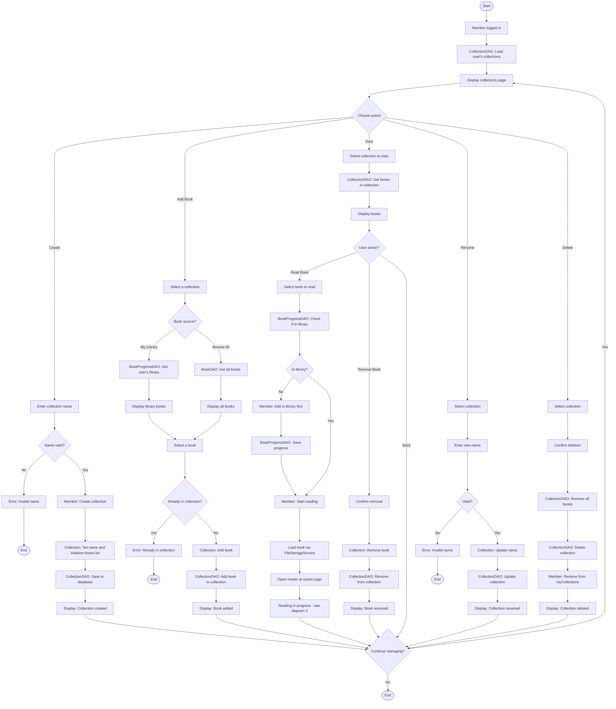

# Member Collection Management Activity Diagram

```mermaid
flowchart TD
    Start([Start]) --> MemberLoggedIn[Member logged in]
    MemberLoggedIn --> LoadCollections[CollectionDAO: Load user's collections]
    LoadCollections --> DisplayCollections[Display collections page]
    DisplayCollections --> UserAction{Choose action}
    
    %% CREATE COLLECTION
    UserAction -->|Create| EnterName[Enter collection name]
    EnterName --> ValidateName{Name valid?}
    ValidateName -->|No| ErrorName[Error: Invalid name]
    ErrorName --> EndError1([End])
    
    ValidateName -->|Yes| CreateCollection[Member: Create collection]
    CreateCollection --> SetCollectionData[Collection: Set name and initialize books list]
    SetCollectionData --> SaveCollection[CollectionDAO: Save to database]
    SaveCollection --> ShowCreated[Display: Collection created]
    ShowCreated --> Continue1
    
    %% ADD BOOK TO COLLECTION
    UserAction -->|Add Book| SelectCollection[Select a collection]
    SelectCollection --> ChooseBookSource{Book source?}
    
    ChooseBookSource -->|My Library| GetLibraryBooks[BookProgressDAO: Get user's library]
    GetLibraryBooks --> DisplayLibBooks[Display library books]
    DisplayLibBooks --> SelectBook1[Select a book]
    
    ChooseBookSource -->|Browse All| GetAllBooks[BookDAO: Get all books]
    GetAllBooks --> DisplayAllBooks[Display all books]
    DisplayAllBooks --> SelectBook1
    
    SelectBook1 --> CheckDuplicate{Already in collection?}
    CheckDuplicate -->|Yes| ErrorDuplicate[Error: Already in collection]
    ErrorDuplicate --> EndError2([End])
    
    CheckDuplicate -->|No| AddToCollection[Collection: Add book]
    AddToCollection --> SaveBookToCollection[CollectionDAO: Add book to collection]
    SaveBookToCollection --> ShowBookAdded[Display: Book added]
    ShowBookAdded --> Continue1
    
    %% VIEW AND READ
    UserAction -->|View| SelectViewColl[Select collection to view]
    SelectViewColl --> GetBooksInColl[CollectionDAO: Get books in collection]
    GetBooksInColl --> DisplayBooks[Display books]
    DisplayBooks --> ViewAction{User action?}
    
    ViewAction -->|Read Book| SelectToRead[Select book to read]
    SelectToRead --> CheckBookInLib[BookProgressDAO: Check if in library]
    CheckBookInLib --> BookInLib{In library?}
    
    BookInLib -->|No| AddBookToLib[Member: Add to library first]
    AddBookToLib --> SaveNewProgress[BookProgressDAO: Save progress]
    SaveNewProgress --> StartReading
    
    BookInLib -->|Yes| StartReading[Member: Start reading]
    StartReading --> LoadBook[Load book via FileStorageService]
    LoadBook --> OpenBook[Open reader at saved page]
    OpenBook --> ReadingFlow[Reading in progress - see diagram 2]
    ReadingFlow --> Continue1
    
    ViewAction -->|Remove Book| ConfirmRemoveBook[Confirm removal]
    ConfirmRemoveBook --> RemoveBook[Collection: Remove book]
    RemoveBook --> UpdateCollection[CollectionDAO: Remove from collection]
    UpdateCollection --> ShowBookRemoved[Display: Book removed]
    ShowBookRemoved --> Continue1
    
    ViewAction -->|Back| Continue1
    
    %% RENAME COLLECTION
    UserAction -->|Rename| SelectRename[Select collection]
    SelectRename --> EnterNewName[Enter new name]
    EnterNewName --> ValidateNewName{Valid?}
    ValidateNewName -->|No| ErrorRename[Error: Invalid name]
    ErrorRename --> EndError3([End])
    
    ValidateNewName -->|Yes| UpdateName[Collection: Update name]
    UpdateName --> SaveRename[CollectionDAO: Update collection]
    SaveRename --> ShowRenamed[Display: Collection renamed]
    ShowRenamed --> Continue1
    
    %% DELETE COLLECTION
    UserAction -->|Delete| SelectDelete[Select collection]
    SelectDelete --> ConfirmDelete[Confirm deletion]
    ConfirmDelete --> DeleteCollBooks[CollectionDAO: Remove all books]
    DeleteCollBooks --> DeleteColl[CollectionDAO: Delete collection]
    DeleteColl --> RemoveFromMember[Member: Remove from myCollections]
    RemoveFromMember --> ShowDeleted[Display: Collection deleted]
    ShowDeleted --> Continue1
    
    Continue1{Continue managing?}
    Continue1 -->|Yes| DisplayCollections
    Continue1 -->|No| End([End])
```
