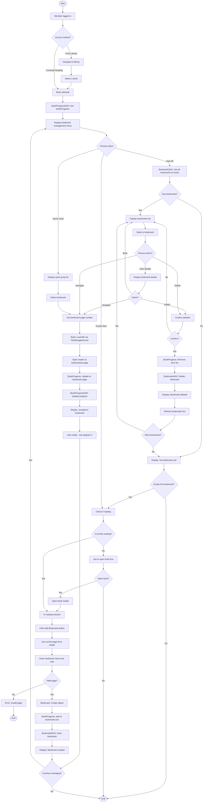

# Bookmark Management Activity Diagram

```mermaid
flowchart TD
    Start([Start]) --> MemberLoggedIn[Member logged in]
    MemberLoggedIn --> AccessMethod{Access method?}
    
    AccessMethod -->|From Library| NavLibrary[Navigate to library]
    NavLibrary --> SelectBookFromLib[Select a book]
    SelectBookFromLib --> GotBook
    
    AccessMethod -->|Currently Reading| GotBook[Book selected]
    
    GotBook --> GetProgress[BookProgressDAO: Get BookProgress]
    GetProgress --> ShowBookmarkMenu[Display bookmark management menu]
    ShowBookmarkMenu --> UserAction{Choose action}
    
    %% VIEW ALL BOOKMARKS
    UserAction -->|View All| LoadBookmarks[BookmarkDAO: Get all bookmarks for book]
    LoadBookmarks --> CheckEmpty{Has bookmarks?}
    
    CheckEmpty -->|No| ShowNoBookmarks[Display: No bookmarks yet]
    ShowNoBookmarks --> AskCreate{Create first bookmark?}
    AskCreate -->|Yes| GoToCreate
    AskCreate -->|No| End([End])
    
    CheckEmpty -->|Yes| DisplayBookmarksList[Display bookmarks list]
    DisplayBookmarksList --> SelectBookmark[Select a bookmark]
    SelectBookmark --> BookmarkAction{Choose action?}
    
    BookmarkAction -->|View Details| ShowDetails[Display bookmark details]
    ShowDetails --> DetailAction{Action?}
    DetailAction -->|Navigate| GoToNavigate
    DetailAction -->|Delete| GoToDelete
    DetailAction -->|Back| DisplayBookmarksList
    
    %% NAVIGATE TO BOOKMARK
    BookmarkAction -->|Navigate| GoToNavigate[Get bookmark page number]
    GoToNavigate --> LoadBookFile[Book: Load file via FileStorageService]
    LoadBookFile --> OpenAtPage[Open reader at bookmarked page]
    OpenAtPage --> UpdateProgressToBookmark[BookProgress: Update to bookmark page]
    UpdateProgressToBookmark --> SaveProgressUpdate[BookProgressDAO: Update progress]
    SaveProgressUpdate --> ShowNavigated[Display: Jumped to bookmark]
    ShowNavigated --> UserReading[User reads - see diagram 2]
    UserReading --> Continue1
    
    %% DELETE BOOKMARK
    BookmarkAction -->|Delete| GoToDelete[Confirm deletion]
    GoToDelete --> UserConfirms{Confirm?}
    UserConfirms -->|No| DisplayBookmarksList
    
    UserConfirms -->|Yes| RemoveFromProgress[BookProgress: Remove from list]
    RemoveFromProgress --> DeleteBookmark[BookmarkDAO: Delete bookmark]
    DeleteBookmark --> ShowDeleted[Display: Bookmark deleted]
    ShowDeleted --> RefreshList[Refresh bookmarks list]
    RefreshList --> CheckRemaining{More bookmarks?}
    CheckRemaining -->|Yes| DisplayBookmarksList
    CheckRemaining -->|No| ShowNoBookmarks
    
    %% CREATE NEW BOOKMARK
    UserAction -->|Create New| GoToCreate[Check if reading]
    GoToCreate --> InReading{Currently reading?}
    
    InReading -->|No| AskOpenBook[Ask to open book first]
    AskOpenBook --> WantOpen{Open book?}
    WantOpen -->|No| End
    WantOpen -->|Yes| OpenBookToRead[Open book reader]
    OpenBookToRead --> InReadingSession
    
    InReading -->|Yes| InReadingSession[In reading session]
    InReadingSession --> ClickAddBookmark[Click Add Bookmark button]
    ClickAddBookmark --> GetCurrentPage[Get current page from reader]
    GetCurrentPage --> EnterBookmarkNote[Enter bookmark name and note]
    EnterBookmarkNote --> ValidateBookmark{Valid page?}
    
    ValidateBookmark -->|No| ErrorBookmark[Error: Invalid page]
    ErrorBookmark --> EndError([End])
    
    ValidateBookmark -->|Yes| CreateBookmarkObj[Bookmark: Create object]
    CreateBookmarkObj --> AddToProgress[BookProgress: Add to bookmarks list]
    AddToProgress --> SaveBookmark[BookmarkDAO: Save bookmark]
    SaveBookmark --> ShowBookmarkCreated[Display: Bookmark created]
    ShowBookmarkCreated --> Continue1
    
    %% QUICK JUMP
    UserAction -->|Quick Jump| ShowQuickList[Display quick jump list]
    ShowQuickList --> SelectQuickBookmark[Select bookmark]
    SelectQuickBookmark --> GoToNavigate
    
    Continue1{Continue managing?}
    Continue1 -->|Yes| ShowBookmarkMenu
    Continue1 -->|No| End
```
