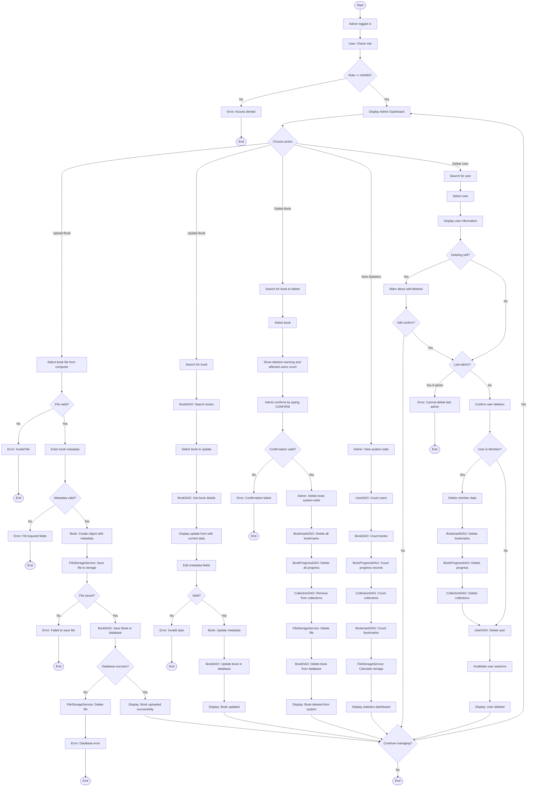

# Admin Book Management Activity Diagram

```mermaid
flowchart TD
    Start([Start]) --> AdminLogin[Admin logged in]
    AdminLogin --> VerifyRole[User: Check role]
    VerifyRole --> IsAdmin{Role == ADMIN?}
    
    IsAdmin -->|No| AccessDenied[Error: Access denied]
    AccessDenied --> EndError1([End])
    
    IsAdmin -->|Yes| ShowDashboard[Display Admin Dashboard]
    ShowDashboard --> AdminAction{Choose action}
    
    %% UPLOAD BOOK
    AdminAction -->|Upload Book| SelectFile[Select book file from computer]
    SelectFile --> ValidateFile{File valid?}
    
    ValidateFile -->|No| ErrorFile[Error: Invalid file]
    ErrorFile --> EndError2([End])
    
    ValidateFile -->|Yes| EnterMetadata[Enter book metadata]
    EnterMetadata --> ValidateMetadata{Metadata valid?}
    
    ValidateMetadata -->|No| ErrorMetadata[Error: Fill required fields]
    ErrorMetadata --> EndError3([End])
    
    ValidateMetadata -->|Yes| CreateBook[Book: Create object with metadata]
    CreateBook --> SaveFile[FileStorageService: Save file to storage]
    SaveFile --> FileSuccess{File saved?}
    
    FileSuccess -->|No| ErrorSave[Error: Failed to save file]
    ErrorSave --> EndError4([End])
    
    FileSuccess -->|Yes| SaveBookDB[BookDAO: Save Book to database]
    SaveBookDB --> DBSuccess{Database success?}
    
    DBSuccess -->|No| RollbackFile[FileStorageService: Delete file]
    RollbackFile --> ErrorDB[Error: Database error]
    ErrorDB --> EndError5([End])
    
    DBSuccess -->|Yes| ShowUploadSuccess[Display: Book uploaded successfully]
    ShowUploadSuccess --> Continue1
    
    %% UPDATE BOOK
    AdminAction -->|Update Book| SearchBook[Search for book]
    SearchBook --> BookSearchResults[BookDAO: Search books]
    BookSearchResults --> SelectBook[Select book to update]
    SelectBook --> LoadBook[BookDAO: Get book details]
    LoadBook --> ShowUpdateForm[Display update form with current data]
    ShowUpdateForm --> EditMetadata[Edit metadata fields]
    EditMetadata --> ValidateUpdate{Valid?}
    
    ValidateUpdate -->|No| ErrorUpdate[Error: Invalid data]
    ErrorUpdate --> EndError6([End])
    
    ValidateUpdate -->|Yes| UpdateBook[Book: Update metadata]
    UpdateBook --> SaveUpdate[BookDAO: Update book in database]
    SaveUpdate --> ShowUpdateSuccess[Display: Book updated]
    ShowUpdateSuccess --> Continue1
    
    %% DELETE BOOK
    AdminAction -->|Delete Book| SearchDelete[Search for book to delete]
    SearchDelete --> SelectDelete[Select book]
    SelectDelete --> ShowWarning[Show deletion warning and affected users count]
    ShowWarning --> ConfirmDelete[Admin confirms by typing CONFIRM]
    ConfirmDelete --> ValidateConfirm{Confirmation valid?}
    
    ValidateConfirm -->|No| ErrorConfirm[Error: Confirmation failed]
    ErrorConfirm --> EndError7([End])
    
    ValidateConfirm -->|Yes| CascadeDelete[Admin: Delete book system-wide]
    CascadeDelete --> DeleteBookmarks[BookmarkDAO: Delete all bookmarks]
    DeleteBookmarks --> DeleteProgress[BookProgressDAO: Delete all progress]
    DeleteProgress --> RemoveFromColls[CollectionDAO: Remove from collections]
    RemoveFromColls --> DeleteFile[FileStorageService: Delete file]
    DeleteFile --> DeleteBookRecord[BookDAO: Delete book from database]
    DeleteBookRecord --> ShowDeleteSuccess[Display: Book deleted from system]
    ShowDeleteSuccess --> Continue1
    
    %% VIEW STATISTICS
    AdminAction -->|View Statistics| LoadStats[Admin: View system stats]
    LoadStats --> CountUsers[UserDAO: Count users]
    CountUsers --> CountBooks[BookDAO: Count books]
    CountBooks --> CountProgress[BookProgressDAO: Count progress records]
    CountProgress --> CountCollections[CollectionDAO: Count collections]
    CountCollections --> CountBookmarks[BookmarkDAO: Count bookmarks]
    CountBookmarks --> CalcStorage[FileStorageService: Calculate storage]
    CalcStorage --> DisplayStats[Display statistics dashboard]
    DisplayStats --> Continue1
    
    %% DELETE USER
    AdminAction -->|Delete User| SearchUser[Search for user]
    SearchUser --> SelectUser[Select user]
    SelectUser --> ShowUserInfo[Display user information]
    ShowUserInfo --> CheckSelf{Deleting self?}
    
    CheckSelf -->|Yes| WarnSelf[Warn about self-deletion]
    WarnSelf --> ConfirmSelf{Still confirm?}
    ConfirmSelf -->|No| Continue1
    ConfirmSelf -->|Yes| CheckLastAdmin
    
    CheckSelf -->|No| CheckLastAdmin{Last admin?}
    
    CheckLastAdmin -->|Yes if admin| ErrorLastAdmin[Error: Cannot delete last admin]
    ErrorLastAdmin --> EndError8([End])
    
    CheckLastAdmin -->|No| ConfirmUserDelete[Confirm user deletion]
    ConfirmUserDelete --> CheckMember{User is Member?}
    
    CheckMember -->|Yes| DeleteMemberData[Delete member data]
    DeleteMemberData --> DeleteUserBookmarks[BookmarkDAO: Delete bookmarks]
    DeleteUserBookmarks --> DeleteUserProgress[BookProgressDAO: Delete progress]
    DeleteUserProgress --> DeleteUserColls[CollectionDAO: Delete collections]
    DeleteUserColls --> DeleteUserRecord
    
    CheckMember -->|No| DeleteUserRecord[UserDAO: Delete user]
    DeleteUserRecord --> InvalidateSessions[Invalidate user sessions]
    InvalidateSessions --> ShowUserDeleted[Display: User deleted]
    ShowUserDeleted --> Continue1
    
    Continue1{Continue managing?}
    Continue1 -->|Yes| ShowDashboard
    Continue1 -->|No| End([End])
```
