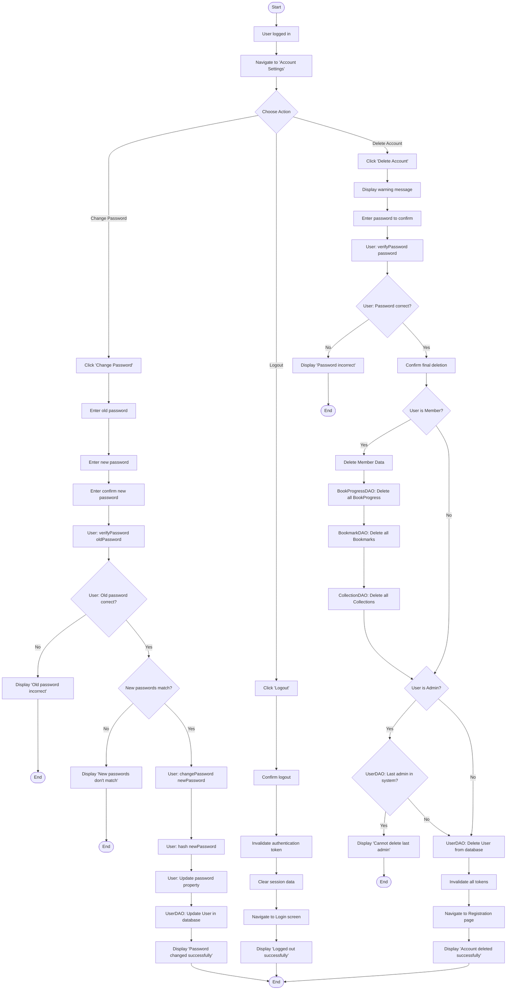

# User Account Management Activity Diagram

```mermaid
flowchart TD
    Start([Start]) --> LoggedIn[User logged in]
    LoggedIn --> NavSettings[Navigate to 'Account Settings']
    NavSettings --> ChooseAction{Choose Action}
    
    ChooseAction -->|Change Password| ClickChange[Click 'Change Password']
    ClickChange --> EnterOld[Enter old password]
    EnterOld --> EnterNew[Enter new password]
    EnterNew --> EnterConfirm[Enter confirm new password]
    EnterConfirm --> VerifyOld[User: verifyPassword oldPassword]
    VerifyOld --> OldCorrect{User: Old password correct?}
    
    OldCorrect -->|No| ErrorOld[Display 'Old password incorrect']
    ErrorOld --> EndError1([End])
    
    OldCorrect -->|Yes| NewMatch{New passwords match?}
    NewMatch -->|No| ErrorMatch[Display 'New passwords don't match']
    ErrorMatch --> EndError2([End])
    
    NewMatch -->|Yes| CallChange[User: changePassword newPassword]
    CallChange --> HashNew[User: hash newPassword]
    HashNew --> UpdatePass[User: Update password property]
    UpdatePass --> SavePass[UserDAO: Update User in database]
    SavePass --> DisplayChanged[Display 'Password changed successfully']
    DisplayChanged --> End([End])
    
    ChooseAction -->|Logout| ClickLogout[Click 'Logout']
    ClickLogout --> ConfirmLogout[Confirm logout]
    ConfirmLogout --> InvalidateToken[Invalidate authentication token]
    InvalidateToken --> ClearSession[Clear session data]
    ClearSession --> NavLogin[Navigate to Login screen]
    NavLogin --> DisplayLogout[Display 'Logged out successfully']
    DisplayLogout --> End
    
    ChooseAction -->|Delete Account| ClickDelete[Click 'Delete Account']
    ClickDelete --> DisplayWarning[Display warning message]
    DisplayWarning --> EnterPass[Enter password to confirm]
    EnterPass --> VerifyPass[User: verifyPassword password]
    VerifyPass --> PassCorrect{User: Password correct?}
    
    PassCorrect -->|No| ErrorPass[Display 'Password incorrect']
    ErrorPass --> EndError3([End])
    
    PassCorrect -->|Yes| ConfirmFinal[Confirm final deletion]
    ConfirmFinal --> CheckUserType{User is Member?}
    
    CheckUserType -->|Yes| DeleteMemberData[Delete Member Data]
    DeleteMemberData --> RemoveProgress[BookProgressDAO: Delete all BookProgress]
    RemoveProgress --> RemoveBookmarks[BookmarkDAO: Delete all Bookmarks]
    RemoveBookmarks --> RemoveColls[CollectionDAO: Delete all Collections]
    RemoveColls --> CheckAdmin{User is Admin?}
    
    CheckUserType -->|No| CheckAdmin
    
    CheckAdmin -->|Yes| LastAdmin{UserDAO: Last admin in system?}
    LastAdmin -->|Yes| ErrorLastAdmin[Display 'Cannot delete last admin']
    ErrorLastAdmin --> EndError4([End])
    
    LastAdmin -->|No| DeleteUserAccount
    CheckAdmin -->|No| DeleteUserAccount[UserDAO: Delete User from database]
    
    DeleteUserAccount --> InvalidateAll[Invalidate all tokens]
    InvalidateAll --> NavRegister[Navigate to Registration page]
    NavRegister --> DisplayDeleted[Display 'Account deleted successfully']
    DisplayDeleted --> End
```

