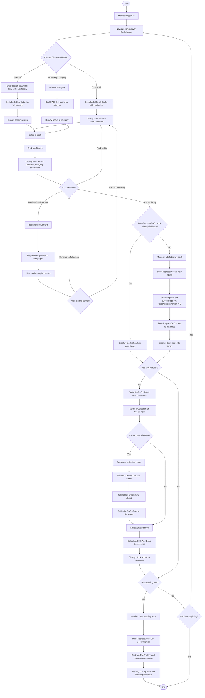

# Book Discovery and Preview Activity Diagram

```mermaid
flowchart TD
    Start([Start]) --> LoggedIn[Member logged in]
    LoggedIn --> DiscoverPage[Navigate to 'Discover Books' page]
    DiscoverPage --> ChooseMethod{Choose Discovery Method}
    
    ChooseMethod -->|Browse All| BrowseAll[BookDAO: Get all Books with pagination]
    BrowseAll --> DisplayBooks[Display book list with covers and info]
    DisplayBooks --> SelectBook[Select a Book]
    
    ChooseMethod -->|Search| EnterSearch[Enter search keywords: title, author, category]
    EnterSearch --> SearchBooks[BookDAO: Search books by keywords]
    SearchBooks --> DisplayResults[Display search results]
    DisplayResults --> SelectBook
    
    ChooseMethod -->|Browse by Category| SelectCategory[Select a category]
    SelectCategory --> FilterByCategory[BookDAO: Get books by category]
    FilterByCategory --> DisplayByCategory[Display books in category]
    DisplayByCategory --> SelectBook
    
    SelectBook --> ViewDetails[Book: getDetails]
    ViewDetails --> DisplayMetadata[Display: title, author, publisher, category, description]
    DisplayMetadata --> UserAction{Choose Action}
    
    UserAction -->|Preview/Read Sample| OpenPreview[Book: getFileContent]
    OpenPreview --> DisplayPreview[Display book preview or first pages]
    DisplayPreview --> ReadingSample[User reads sample content]
    ReadingSample --> AfterPreview{After reading sample}
    
    AfterPreview -->|Continue to full action| UserAction
    AfterPreview -->|Back to browsing| DisplayBooks
    
    UserAction -->|Add to Library| CheckAlreadyInLib{BookProgressDAO: Book already in library?}
    
    CheckAlreadyInLib -->|Yes| AlreadyAdded[Display: Book already in your library]
    AlreadyAdded --> AskAddToCollection{Add to Collection?}
    
    CheckAlreadyInLib -->|No| AddToLibrary[Member: addToLibrary book]
    AddToLibrary --> CreateProgress[BookProgress: Create new object]
    CreateProgress --> InitProgress[BookProgress: Set currentPage = 0, totalProgressPercent = 0]
    InitProgress --> SaveProgress[BookProgressDAO: Save to database]
    SaveProgress --> DisplayAddedMsg[Display: Book added to library]
    DisplayAddedMsg --> AskAddToCollection
    
    AskAddToCollection -->|Yes| GetCollections[CollectionDAO: Get all user collections]
    GetCollections --> SelectCollection[Select a Collection or Create new]
    SelectCollection --> IsNewCollection{Create new collection?}
    
    IsNewCollection -->|Yes| EnterCollName[Enter new collection name]
    EnterCollName --> CreateCollection[Member: createCollection name]
    CreateCollection --> NewCollObject[Collection: Create new object]
    NewCollObject --> SaveCollection[CollectionDAO: Save to database]
    SaveCollection --> AddBookToColl[Collection: add book]
    
    IsNewCollection -->|No| AddBookToColl
    AddBookToColl --> SaveBookToColl[CollectionDAO: Add Book to collection]
    SaveBookToColl --> DisplayCollAdded[Display: Book added to collection]
    DisplayCollAdded --> AskStartReading{Start reading now?}
    
    AskAddToCollection -->|No| AskStartReading
    
    AskStartReading -->|Yes| StartReading[Member: startReading book]
    StartReading --> GetProgress[BookProgressDAO: Get BookProgress]
    GetProgress --> OpenBook[Book: getFileContent and open at current page]
    OpenBook --> ReadingInProgress[Reading in progress - see Reading Workflow]
    ReadingInProgress --> End([End])
    
    AskStartReading -->|No| MoreActions{Continue exploring?}
    
    UserAction -->|Back to List| DisplayBooks
    
    MoreActions -->|Yes| DiscoverPage
    MoreActions -->|No| End
```

