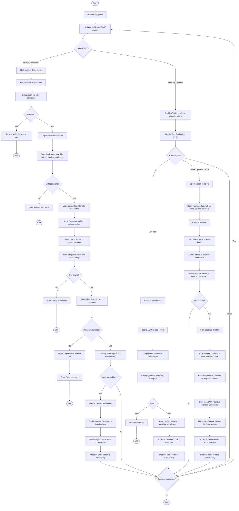

# Member Book Upload Activity Diagram

## Required Methods

### User (inherited by Member)
- `uploadBook(String filePath, String title, String author): void` - Upload new book to system
- `deleteUploadedBook(Book book): void` - Delete a book uploaded by this user

### Member
- `addToLibrary(Book book): void` - Add uploaded book to personal library

### Book
- `Book(String title, String author, String publisher, String category)` - Constructor
- `setUploader(User uploader): void` - Set who uploaded the book
- `updateMetadata(String newTitle, String newAuthor, ...): void` - Update book info
- `getUploader(): User` - Get who uploaded the book

### BookDAO
- `addBook(Book book): void` - Add new book to database
- `updateBook(Book book): void` - Update book metadata
- `deleteBook(int bookId): void` - Delete book from database
- `getBooksByUploader(int userId): List<Book>` - Get all books uploaded by a user
- `getBookById(int bookId): Book` - Get book by ID

### BookProgress
- `BookProgress(Book book, Member member)` - Constructor

### BookProgressDAO
- `addBookProgress(BookProgress progress): void` - Add new progress record
- `deleteAllProgressForBook(int bookId): void` - Delete all progress for a book

### BookmarkDAO
- `deleteAllBookmarksForBook(int bookId): void` - Delete all bookmarks for a book

### CollectionDAO
- `removeBookFromAllCollections(int bookId): void` - Remove book from all collections

### FileStorageService
- `saveFile(File file, String filename): String` - Save file to storage, return path
- `deleteFile(String filePath): void` - Delete file from storage

